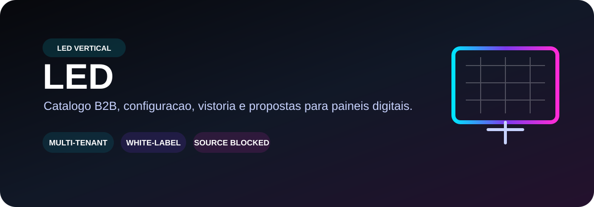
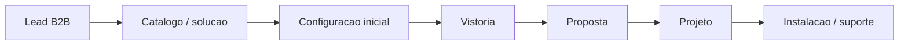

  

  
  
  

# LED

Vertical planejado para empresas de **painéis de LED, digital signage e projetos audiovisuais B2B** dentro do Tupiniquim Vertical SaaS.

> **Estado real:** este repositório ainda não contém a implementação canônica do produto. O escopo abaixo vem do planejamento do SaaS e **não deve ser interpretado como funcionalidade já entregue**.

## 🎯 Escopo planejado

| 🖥️ Catálogo B2B | 🧮 Configurador | 📍 Vistoria | 📄 Propostas |
| --- | --- | --- | --- |
| Painéis, aplicações, especificações e soluções | Dimensões, ambiente, montagem e requisitos do projeto | Levantamento técnico e informações do local | Propostas comerciais e técnicas por oportunidade |

| 🏗️ Projetos | 🛠️ Suporte | 🎨 White-label | 🔐 SaaS Core |
| --- | --- | --- | --- |
| Pipeline de projeto do lead à instalação | Pós-venda, manutenção e atendimento | Marca, catálogo, mídia, contatos e domínio por tenant | Tenancy, RBAC, audit, entitlements e observabilidade compartilhados |

## 🧭 Jornada alvo

## 🧩 Direção SaaS

Quando a fonte canônica de implementação for recuperada, a migração deve seguir **copy + reconcile + validate**, preservando layout, mídia legítima, conteúdo real e histórico útil. Novo cliente deve ser **tenant**, não fork.

## 🔐 Segurança e qualidade esperadas

- isolamento por tenant server-side;
- RBAC e permissões comerciais/técnicas;
- documentos e uploads tenant-aware;
- rate limiting em formulários, uploads e endpoints caros;
- secrets fora do Git e do frontend;
- audit log para ações privilegiadas;
- dados demo separados de dados reais;
- CI com lint/typecheck/tests/build/audit quando a implementação estiver disponível.

## 📚 Referências

- [Monorepo canônico — Sistema SaaS Geral](https://github.com/tupiniquimtechsolution-blip/Sistema-SaaS-Geral)

## 🚧 Bloqueio atual

`BLOCKED_SOURCE_REPOSITORY_LED`

Antes de declarar qualquer feature como pronta, é necessário recuperar ou confirmar a implementação real do vertical LED e então executar auditoria, importação, validação e gates do Tupiniquim Toolbox.
